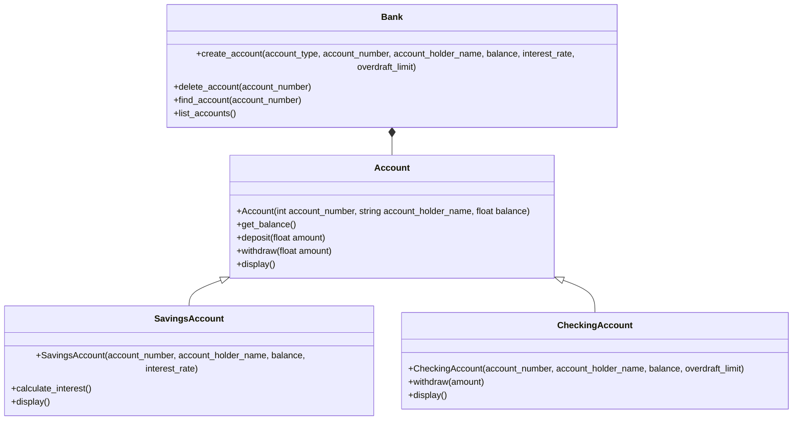

# UML Class Diagram

```mermaid
classDiagram
    Account <|-- SavingsAccount
    Account <|-- CheckingAccount
    Bank *-- Account
      class Bank {
          +create_account(account_type, account_number, account_holder_name, balance, interest_rate, overdraft_limit) 
          +delete_account(account_number)
          +find_account(account_number) 
          +list_accounts() 
      }
      class Account {
          +Account(int account_number, string account_holder_name, float balance)
          +get_balance()
          +deposit(float amount) 
          +withdraw(float amount)
          +display()
      }
      class SavingsAccount  {
          +SavingsAccount(account_number, account_holder_name, balance, interest_rate) 
          +calculate_interest() 
          +display() 
      }
      class CheckingAccount {
          +CheckingAccount(account_number, account_holder_name, balance, overdraft_limit) 
          +withdraw(amount) 
          +display() 
      }
```
