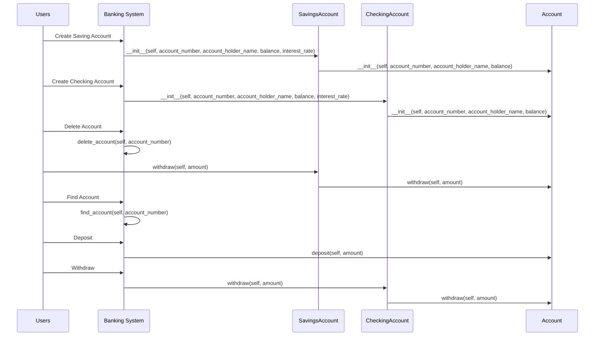

# UML Sequence Diagram

```mermaid
sequenceDiagram
  participant Users
  participant Banking System
  participant SavingsAccount
  participant CheckingAccount
  participant Account
  
  Users->>Banking System: Create Saving Account
  Banking System->>SavingsAccount: __init__(self, account_number, account_holder_name, balance, interest_rate)
  SavingsAccount->>Account:__init__(self, account_number, account_holder_name, balance)
  
  Users->>Banking System: Create Checking Account
  Banking System->>CheckingAccount: __init__(self, account_number, account_holder_name, balance, interest_rate)
  CheckingAccount->>Account:__init__(self, account_number, account_holder_name, balance)
  
  Users->>Banking System: Delete Account
  Banking System->>Banking System: delete_account(self, account_number)
  Users->>SavingsAccount: withdraw(self, amount)
  SavingsAccount->>Account: withdraw(self, amount)
  
  Users->>Banking System: Find Account
  Banking System->>Banking System: find_account(self, account_number)
  
  Users->>Banking System: Deposit
  Banking System->>Account: deposit(self, amount)
  
   Users->>Banking System: Withdraw
   Banking System->>CheckingAccount: withdraw(self, amount)
   CheckingAccount->>Account: withdraw(self, amount)
  
```
